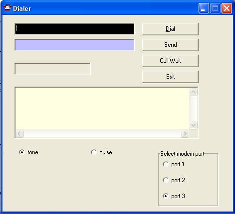



## phone\_chat

### Description

a prof code of what i saw here

Connection Via the Telephone line.No internet or cable.Just the telephone line

This article's purpose is to (reallllly) teach you how to connect with a remote system using your simple telephone line.No internet or special pc-cable required.It's pretty simple.

To sum up it will let you connnect with your friend's pc and send and recieve messages.
 
### More Info
 

             |
---                |---
**Submitted On**   |2005-04-22 08:25:14
**By**             |[Salim Basse](https://github.com/Planet-Source-Code/PSCIndex/blob/master/ByAuthor/salim-basse.md)
**Level**          |Advanced
**User Rating**    |5.0 (119 globes from 24 users)
**Compatibility**  |VB 3\.0, VB 4\.0 \(16\-bit\), VB 4\.0 \(32\-bit\), VB 5\.0, VB 6\.0, ASP \(Active Server Pages\) 
**Category**       |[Complete Applications](https://github.com/Planet-Source-Code/PSCIndex/blob/master/ByCategory/complete-applications__1-27.md)
**World**          |[Visual Basic](https://github.com/Planet-Source-Code/PSCIndex/blob/master/ByWorld/visual-basic.md)
**Archive File**   |[phone\_chat1880004222005\.zip](https://github.com/Planet-Source-Code/salim-basse-phone-chat__1-60152/archive/master.zip)

